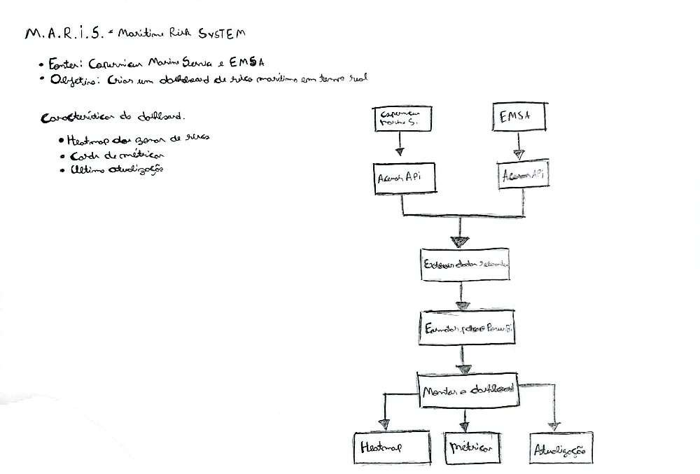

# MARIS

Um dashboard de risco marítimo em tempo real, baseado nos dados da Copernicus Marine Service e da EMSA

# Arquitetura do Projeto

# Introduction

O trabalho consiste no desenvolvimento de um Dashboard Interativo criado na plataforma Power BI da Microsoft, com o objetivo de fornecer uma visão detalhada para o controle e monitoramento das embarcações e do risco marítimo em uma certa área.

O dashboard possui duas páginas, uma delas foca no monitoramento das embarcações registradas através dos chamados AIS enviados, e a segunda página foca nas áreas de risco presentes no mapa. Unindo as informações presentes em ambas as páginas, é possível saber quais embarcações irão passar por áreas de risco em potencial.

# Development

Inicialmente, os dados que seriam utilizados para a formulação desse dashboard seriam extraídos das plataformas da Copernicus Marine Service e EMSA, porém, o docente Paulo Vieira forneceu outro dataset em formato CSV para ser utilizado, que possuía dados referentes a chamados AIS de várias embarcações.

O dataset fornecido tinha mais de 30.000 entradas, pesando mais de 2GB, portanto, os visuais do Power BI em sua grande maioria não conseguiam lidar com tantos dados, e um tratamento de dados foi efetuado, diminuindo as entradas para cerca de 200 para que os visuais não tivessem nenhum problema para carregar.

Esse dataset não possuía dados referente a embarcações na costa de Portugal, ou de outros lugares da Europa, então, foi decidido focar nos dados referentes a embarcações presentes na costa dos EUA, que formavam a grande maioria dos dados desse dataset. Para manter a coerência, o outro dataset utilizado nesse dashboard também possui apenas dados dos EUA.

Após a extração e tratamento dos dados do dataset fornecido, a primeira página do dashboard foi montada, utilizando os visuais “Azure Map”, “Advance Card” e “Text Filter”, com os dois últimos sendo visuais obtidos através do “Power BI Visuals”, não estando disponíveis normalmente.

Configurando os campos com os dados corretos do dataset, a primeira página exibia as seguintes informações:

•	Mapa com a localização de todas as embarcações do dataset;

•	Velocidade média dos barcos (em Nós);

•	Velocidade máxima dos barcos (em Nós);

•	Quantidade de Embarcações exibidas no mapa;

•	Gráfico de Colunas Empilhadas exibindo a quantidade de barcos no mapa por tipo.

Com essas informações, é possível identificar a posição de cada barco do dataset, o que é essencial para o controle de riscos.
Após a implementação da primeira página do dashboard, foi necessário obter outro dataset para a formulação da segunda página. Como esse protótipo é apenas demonstrativo, utilizei um dataset com dados mockados (dados criados apenas para demonstração/teste) para a formulação do mesmo, esse dataset consistia em informações sobre lagos, rios e sobre o mar dos EUA.

Com esses dados em mãos, a segunda pagina foi formulada de forma bem similar a primeira, com o intuito de montar um mapa que exibe as áreas de maior risco através de bolhas no mapa de diferentes cores e tamanhos. Para isso, foi necessário criar uma coluna calculada no Power BI, que definia uma categoria de risco para cada uma das entradas do dataset através da coluna “risk_index”.

 Finalizando o mapa, alguns “Advance Cards” e gráficos foram utilizados para exibir algumas métricas, como:

•	Tamanho médio das ondas (em metros);

•	Velocidade média do vento (em km/h);

•	Média de histórico de acidentes por local;

•	Gráfico de áreas por nível de risco.

Com as duas paginas terminadas, é possível utilizar ambas para ver quais embarcações estão ou irão passar por áreas de risco, e planejar medidas de segurança reforçadas para tal.

# Conclusion

Em conclusão, neste trabalho foi possível montar um dashboard interativo multifuncional através das diversas funções disponibilizadas pelo Power BI, porém, o projeto ainda se mantém apenas como um protótipo, pois ainda lhe faltam inúmeras funcionalidades.

Futuramente, para que o dashboard funcione de forma ideal, seria necessário ligá-lo com uma API de alguma plataforma como a Copernicus ou a EMSA e configurá-lo para fazer atualizações constantes, tornando um dashboard que mostra as informações em tempo real, uma funcionalidade que não foi possível implementar. Além disso, seria necessário publicá-lo, o que exigiria uma licença profissional da aplicação Power BI.

